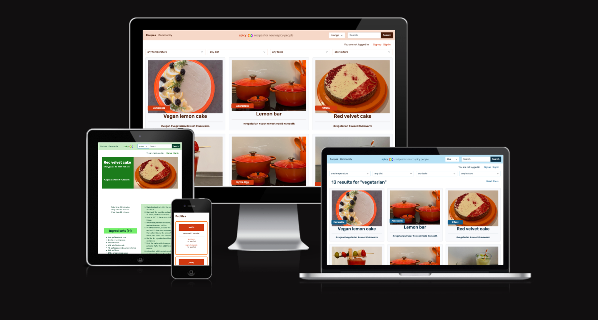
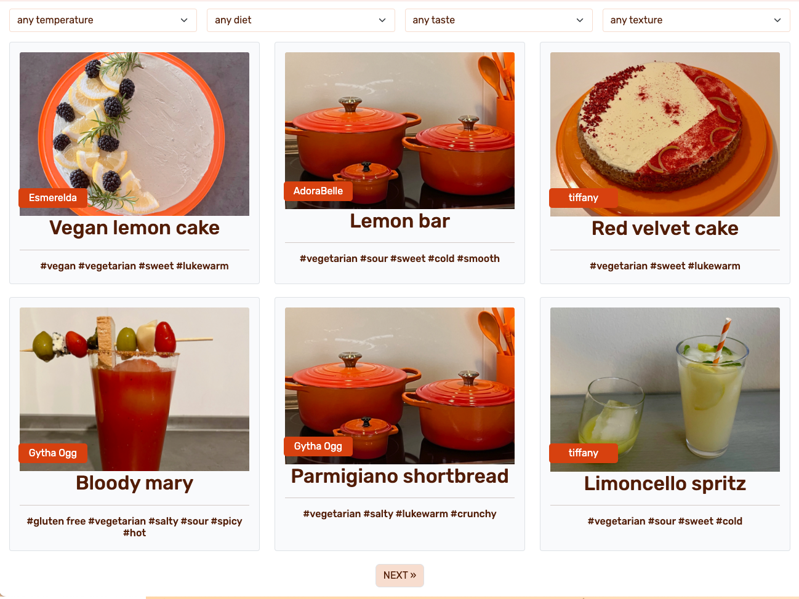
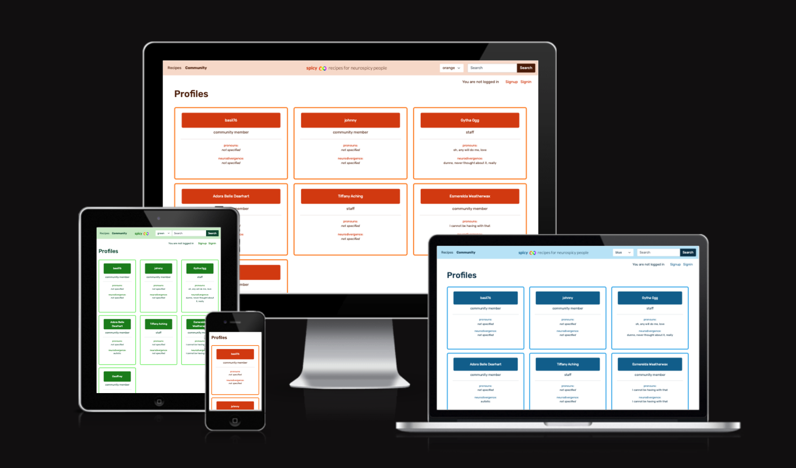
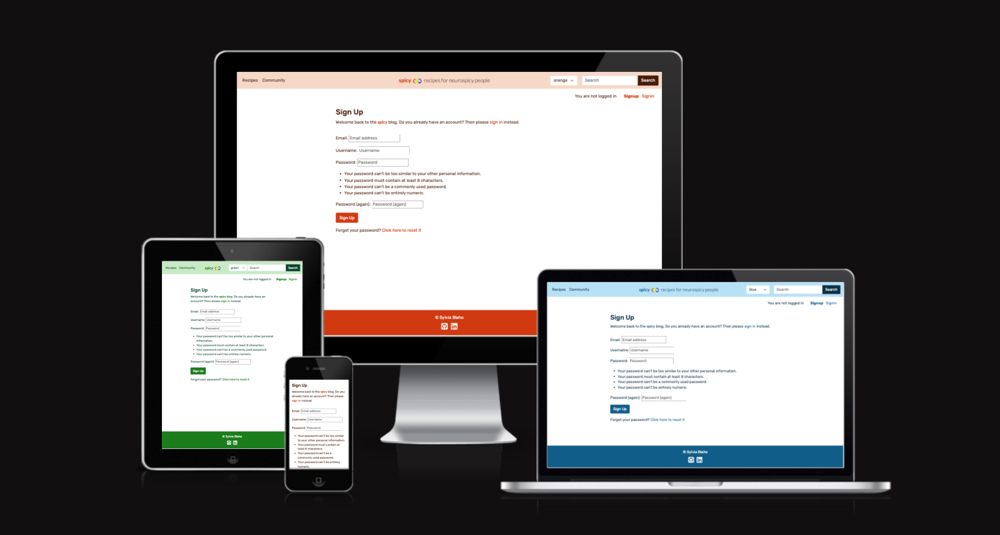
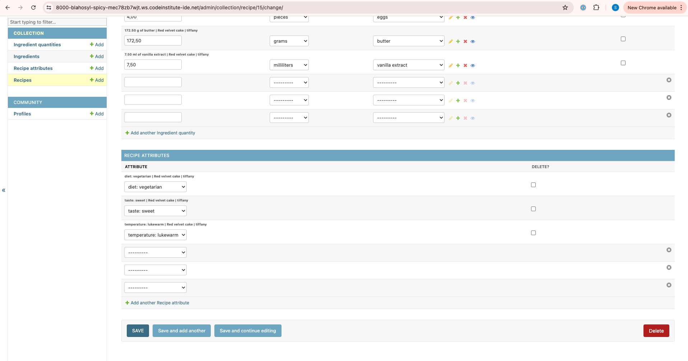

<!--Shield.io badges-->

# Spicy Recipes

A recipe blog for autistic and other [neurospicy](https://www.neurosparkhealth.com/blog/neurospicy-meaning-what-it-means-and-where-it-came-from.html) folx. Utilitarian, customizable and to the point. No rambling, no unrelated stories, no word count fillers, no distracting desgin kitsch or vertigo-inducing moving backgrounds. Instead, the focus is on precise and searchable information to easily find recipes for specific needs.

Developer: [Dr. Sylvia Blaho](https://www.linkedin.com/in/blahosylvia/)



[Go to the deployed app](https://spicy-recipes-django-5d174ffc7c94.herokuapp.com/)

See the development progress and further plans on [GitHub Projects](https://github.com/users/blahosyl/projects/5/views/2).


## Table of Contents

## UX/UI

### Strategy

In a world designed for neurotypical people, the needs of neurodivergent people are often disregarded. When it comes to recipe blogs, the 3 main culprits I aim to tackle in this project are

- [superfluos information](#superfluos-information)
- [lack of specificity](#lack-of-specificity)
- [lack of customization](#dopamine-design)

Each issue and its implemented mitigation is described below.

#### Superfluos information

An [oft-parodied trend](https://www.facebook.com/reel/771271748497011) of many food blogs is their inflated word count by paraphrasing and unlerated personal stories, presumably in an effort to improve their SEO ranking.

While this is a mild annoyance to neutotypical people, it can be a serious accessibility issue for those who are neurodivergent and have executive functioning issues, such as problems focusing or [front-end perfectionism](https://www.psychologytoday.com/us/blog/rethinking-adult-adhd/202012/adult-adhd-perfectionism-and-procrastination).

#### Lack of specificity

Many autistic people are very particular about food (termed [food selectivity](https://www.ncbi.nlm.nih.gov/pmc/articles/PMC10488249/) in scientific literature; [some](https://www.ncbi.nlm.nih.gov/pmc/articles/PMC10488249/table/jcm-12-05469-t002/?report=objectonly) [examples](https://www.ncbi.nlm.nih.gov/pmc/articles/PMC10488249/table/jcm-12-05469-t004/?report=objectonly)). However, most recipe blogs do not offer easy ways to search for particular textures, tastes or temperatures.

#### Dopamine design

Analogous to [dopamine dressing](https://fromtheslowlane.com/anywhere/fashion/what-is-dopamine-dressing/), being able to surround themselves with colors that match or complement their mood and energy levels is a useful coping strategy for neurodivergent people.


### Scope

#### Clearly separated fields for creating and viewing recipes

To combat the problem of [superfluos information](#superfluos-information), this recipe site is designed to clearly separate the different components of a recipe to provide a better overview for visitors, and a helpful template for recipe writers.

#### Searching and filtering

To address the problem of [lack of specificity](#lack-of-specificity), this recipe blog has an emphasis on tagging, searching and filtering recipes, enabling visitors to find recipes matching their specific needs.


#### Alternative color themes

To facilitate users being able to [customize the look of the site](#dopamine-design), the blog offers a selection of color themes that users can chose from.

#### Planning and prioritization

Along with usual blog features like access management, post management and collaboration, the following Themes, Epics and User Stories were defined at the beginning of the project (click [here](https://docs.google.com/spreadsheets/d/1QDYJlX4RVgoKokpcXgFkGtmrwcCMplf8XZcpNxoEYRU/) for the original Sheet):


However, as the development time available for the project was only 1 month, and this was my first Django project, these User Stories were vetted based on whether they were to be part of the Minimum Viable Product (MVP) or not.

Based on the considerations specific to a neurodivergent audience (described above), clarity of presentation and customizability was rated more important than collaboration.

Accordingly, the User Stories in the MVP were determined as follows (click [here](https://docs.google.com/spreadsheets/d/1QDYJlX4RVgoKokpcXgFkGtmrwcCMplf8XZcpNxoEYRU/) for the original Sheet):


Naturally, this list was modified somewhat during development (see the [Prioritization](#prioritization) section for details). The final list can be seen in [GitHub Issues](https://github.com/blahosyl/spicy/issues?page=2&q=is%3Aissue+label%3A%22p%3A+must+have%22+-label%3A%22epic%22+-label%3A%22e%3A+readme%22+-label%3A%22e%3A+testing%22+-label%3A%22e%3A+code+validation%22+-label%3A%22e%3A+code+structure+%26+comments%22+-label%3Abug).

### Structure

#### Data models

The initial design of data models was as follows:


Notable aspects of the models are described below.

##### Recipe model

Partially based on the Post model of the I Think Therefore I Blog walkthrough, but changed several aspects:

- Published is Boolean
- Separated content into
	- Instructions
	- PrepTime
	- CookTime
	- Ingredients (separate model)

##### Ingredient & IngredientQuantity models

Ingredients are available across the project, while IngredientQuantities are specific to individual recipes.

The reasoning behind this setup was threefold:

1. To allow for more fine-grained access permissions
2. To lay the foundations for a future implementation of a shopping list making functionality, along the lines of the [Dinner Party app I made](https://github.com/blahosyl/dinner-party/).
3. The intermediary IngredientQuantity model also has unit and quantity attributes. 

###### Quantity data type

[Decimal](https://docs.python.org/3/library/decimal.html#module-decimal) instead of float used for quantity.

###### IngredientQuantity not compulsory

Recipes can be saved without any ingredients (to allow better management of  drafts).

###### Instances of Ingredient cannot be duplicated

Instances of ingredient where `ingr_name` & `preparation` is the same cannot be duplicated. 

- "cheese, sliced" and "cheese, grated" are both possible
- 2 instances of "cheese, grated" are not allowed

This is true when added new ingredients as well as when editing exisitng one would result in a duplicated.

###### IngredientQuantities **can** be duplicated

Each instance of IngredientQuantity is unique, that is, even if there are 2 recipes that call for 2 apples each, these are treated as separate entities.

##### Comment model

This model is based entirely on the Comment model of the [I Think Therefore I Blog walkthrough project]((https://github.com/Code-Institute-Solutions/blog)).

##### RecipeAttribute and Attribute models

These models were added to the intial desgin in order to enable more filtering and more precise tagging of recipes. 
Their implementation parallels IngredientQuantity and Ingredient:
RecipeAttribute acts as an intermediary between the Recipe and Attribute models.

Using this design as oppsed to a ManyToManyField relation between Recipe and Attribute enables setting up a better control of the scope of permissions for staff users.

##### Profile model

When implementing the `community` app of the project, this model was added to store public information about the users, with the intention that logged-in users will be able to create and manage profiles for themselves.

Crucially, the Profile model is distinct from the built-in User model, connected by a OnetoOne field. 

There are 2 advantages to this setup:

1. Allow for user information to be accessible in the admin panel but not on the website UI
2. Avoid accidentally overwriting crucial user information needed for signin and permissions.

Accordingly, the current Entity Relationship Diagram is as follows:


#### Access management

The project implemented signup, signin and signout functionalities by using [Allauth](https://docs.allauth.org).

[CRUD](#crud) functionalities are only available to logged-in users.

Visitors who are not logged in can still access the search, filter and color theme functionalities.

#### CRUD

Logged-in users can Create, Read, Update and Delete their own comments. This functionality is implemented following the walkthrough project.

In addition, Staff users can access the Admin Panel and Create, Read, Update and Delete their own recipes, ingredient quantities, recipe attributes and profiles. 
Only their own objects are available to Staff users in the Admin Panel, while the Superuser can manage all objects.

#### UI information design

##### Navigation bar

This is present on every page, thus it contains elements that are used throughout the site.

The most prominent position has the navigation links letting the user switch between the `collection` app containing the reicpes, and the `community` app containing the user profiles.

The center position of the nav bar has the blog name, logo and tagline.

On the right, we find the color theme selector toggle and the recipe search bar, but of these being important targeted features of the project.

##### Collection app

As the primary purpose of the project is to show recipes, the home page of the site displays the list of published recipes. 

The recipe filters are prominently placed at the top, since it is anticipated that this feature will be widely used by the target audience.

Clicking on any recipe takes the visitor to the recipe detail page.

##### Community app

To ease navigation, this app is laid out similarly to the `collection` app: the main page show a list of profiles, and clicking on them leads to the profile detail page.

##### Footer

The footer is also present on every page, but the information contained here is predicted to be used less frequently: the developer name and social media profile links.

### Skeleton

#### Home page wireframes

Since this recipe blog is modelled after the [I Think Therefore I Blog walkthrough project](https://github.com/Code-Institute-Solutions/blog), and one of the project's aims is to keep layouts simple and intuitive, the basic layout of the home page and footer was not modified significantly (see the [UX improvements](#ux-improvements) section for changes that might not be obvious at first glance).

However, I decided to make several alterations and additions to the navigation bar.

First, I visually separated page navigation from access management functions (signing up/in/out): the page navigation stayed in the top left corner in the navigation, but access management links and information were moved to the so-called "user bar" immediately below.

Within the user bar, (semi-)permanent information was moved to the right side, while the left portion of the user bar was reserved for ephemeral dismissable messages having to do with signing in/out.


I also moved the blog name to the middle of the navigation bar.

The right side of the navigation bar has the color theme toggle and the search field.

The mobile version of the recipe list (with the nav bar open) was mocked up as follows:


#### Recipe detail wireframes

I have made some more significant changes to the recipe detail page, since the way the data are stored is also more detailed than in the walkthrough project.

I separated the space under the masthead into 2 columns: the smaller one on the left has concrete, bite-sized and easily parsable information like preparation time, cooking time and ingredients. The larger column on the right contained the instructions.


Not shown on the wireframes is the **Comments** section – since this is very much the same as the walkthrough project, I did not make a separate mockup of this. One change I implemented was to show messages to do with comment creation/editing/deletion in the comment section rather than at the top of the page (see the section [UX improvements](#ux-improvements)).

A further addition to the masthead on the recipe detail page is the inclusion of attribute tags.

The mockup of the  mobile version of the recipe detail page is shown below (with the nav bar closed):


I did not make separate wireframes for the profile list and profile detail templates, as these are analogous to their corresponding recipe counterparts.

### Surface

#### Visual design

##### Logo

The logo I chose for this project is the Rainbow Infinity symbol representing autism. This symbol is [most widely used by autistic self-advocacy groups](https://www.123shoot.com/nothing-missing-why-the-puzzle-piece-isnt-used-in-autism-acceptance/), and is in stark contrasts with the [puzzle piece](https://www.altogetherautism.org.nz/autism-no-puzzle-nothing-wrong-with-us/) symbol that has been used to spread many harmful stereotypes about autistic people.


The rainbow infinity logo represents the many different facets of autism, the wide potential of autistic people, and the fact that autism is a circular spectrum without a "mild" end and "severe" end – mirroring the recognition that labels such as "low functioning" or "high functioning" are [harmful and irrelevant](https://www.bristolautismsupport.org/functioning-labels-damaging-irrelevant/).

The logo is also a not-so-subtle nod to Pride month, when this project was developed, as there is a striking correlation between the neurodivergent and queer communities: [autistic people are 8 times more likely to identify as queer as neurodivergent people](https://nhsdorset.nhs.uk/neurodiversity/living/lgbtq/).

##### Minimalism

I have consciously stayed away from any unnecessary visual clutter, such as excessive borders and shadows, elements of very different shapes, background images, and auto-moving elements of all kinds.

These elements tend to cause problems for a variety of users (e.g. those with visual impairment, executive functioning impairment, vertigo, etc.). 
Neurodivergent people are highly likely to experience some of these issues due to their heightened sensory processing, so steering clear of these chimes in perfectly with accessibility goals and particularly suited to the target audience.

##### Color schemes

As detailed in [above](#dopamine-design), I wanted to offer users to customize the color theme of the site to match their particular needs.

For the MVP I designed 3 monochrome color themes: orange, blue and green.
I pland to expand the available themes for future versions of this project.

#### UX Improvements

##### Meaningful navigation link names

The names of the navigation links were changed to **Collection** and **Community**, to better reflect the names of the apps.

##### Easier motor coordination

 On the recipe list and the profile list, the whole card was made clickable instead of just the title, to accommodate those with below average motor coordination (another frequent occurrence within neurodivergent individuals).

##### Localized messages

 I also separated messages based on their function, and had them display in separate locations:

 - messages related to comments pop up right inside the **Comment** block
 - other messages, which at this point are all related to Account Management, pop up in the lefthand side of the user bar (where the Account Management links and information are located).

 This puts all messages physically close to where the relevant actions have been performed, preventing distractions and confusion, and aiding processing.

 ##### Content

 For the content of the recipes, I used photos and text from my own recipe collection.
 
 For mocking up the profile cards, I used characters from Terry Pratchett's Discworld (see also the [Credits](#text) section), as many neurodivergent people see themselves represented by them ([see](https://datsderbunnyblog.tumblr.com/post/638688498056118272/discworlds-best-autistic-power-moves) [these](https://www.tumblr.com/wyrdsisterspodcast) [examples](https://formerlyknownas-delight.tumblr.com/post/172059814822/tiffany-aching-from-the-discworld-book-the-wee)).

 ##### Title

 [Neurospicy](https://www.neurosparkhealth.com/blog/neurospicy-meaning-what-it-means-and-where-it-came-from.html) is a popular self-identification of neurodivergent people, reclaiming their self definition and reframing neurodiversity as something additional or different to neurotypical identities, rather than lacking.

 Given that spicy is also a salient feature of recipes, it seemed natural to combine both meanings in the blog's title.


## Project Management | Agile Methodologies


### Themes, Epics, Stories & Tasks

The work to be done was divided into the following Themes:

- Access management
- Collaboration
- Commenting
- Produce content
- View content

Each theme was then divided into Epics, and Epics into User Stories, as seen here (click [here](https://docs.google.com/spreadsheets/d/1QDYJlX4RVgoKokpcXgFkGtmrwcCMplf8XZcpNxoEYRU/) for the original Sheet):


Each epic was assigned a distinctive color, which was also used for its [label in GitHub Issues](#labels). 
Epics belonging to the same Theme were assigned colors of similar hues.
This facilitated getting an overview of the work items.

Finally User Stories were broken down into tasks. These can be seen for each User Story individually in [GitHub Issues](https://github.com/blahosyl/spicy/issues) and on the [Project Board](#project-board).

As this was my first project using Django, some User Stories have a very detailed task list, both as learning and as documentation/reference.
Issues that have tasks that were already familiar only have high-level bullet points.

Some work items that have initially been classified as Epics have later been reclassified as User Stories – typically these were "meta" items to do with testing and documentation.

### Estimation

Estimating the time it would take to complete each User Story is notoriously difficult, doubly so with the first project  in a new framework. 
This is why I did not assign sizes to the individual User Stories, instead, I treaded them as one unit.

This proved to be the right strategy in retrospect, as inexperince caused me to take disproportionately long on tasks that would be much faster the second time around. On the other side, some other tasks could be completed much faster than estimated. All in all, the lack of relative sizing of individual User Stories did not have an adverse effect on the project.


### Project Board

The Issues were added to the [Project Board](https://github.com/users/blahosyl/projects/5/views/2) in GitHub projects.
This has a table view and a Kanban board view – this was the one I used most during development.

I have customized the Kanban columns to fit the project needs, and also added swimlanes representing milestones.


### Labels

I have used several categories of labels during the project:

- Priority labels (those starting with `p:`)
- An `epic` label to enable filtering between Epics and User Stories on the Project Board
- A label for each epic (those starting with `e:`), to be assigned to the Epic and all its corresponding User Stories(since GitHub Issues does not provide any other way to link these).
The individual epic labels are color-coded to match the [Google Sheet containing User Stories](https://docs.google.com/spreadsheets/d/1QDYJlX4RVgoKokpcXgFkGtmrwcCMplf8XZcpNxoEYRU/)
- Other miscellaneous labels such as `bug`, `enhancement`, `mentor`, etc.

These have provided an excellent way to both filter Issues and to maintain an easier visual overview of them.

#### Prioritization: MoSCoW

As the available time for development was only 3 weeks (setting the 4th week aside for testing and documentation), sorting User Stories into `must have`, `should have`, `could have` and `won't have` was done on the whole group of User Stories rather than on a sprint-by-sprint basis.

I have modified the MoSCoW method slightly in that I split the `won't have` label into two:

- [Issues with the label `wont have`](https://github.com/blahosyl/spicy/issues?q=is%3Aissue+label%3A%22wont+have%22) are duplicates or mistaken issues
- Issues not completed for the first release of the project but still to be done in further development work are assigned the label [`v2`](https://github.com/blahosyl/spicy/issues?q=is%3Aissue+label%3A%22v2%22+).

The links below show the User Stories excluding "meta" issues such as testing & documentation.

- [User Stories with priority `must have`](https://github.com/blahosyl/spicy/issues?page=2&q=is%3Aissue+label%3A%22p%3A+must+have%22+-label%3A%22epic%22+-label%3A%22e%3A+readme%22+-label%3A%22e%3A+testing%22+-label%3A%22e%3A+code+validation%22+-label%3A%22e%3A+code+structure+%26+comments%22+-label%3Abug): 39
- [User Stories with priority `should have`](https://github.com/blahosyl/spicy/issues?q=is%3Aissue+label%3A%22p%3A+should+have%22+-label%3A%22epic%22+-label%3A%22e%3A+readme%22+-label%3A%22e%3A+testing%22+-label%3A%22e%3A+code+validation%22+-label%3A%22e%3A+code+structure+%26+comments%22+-label%3Abug+-label%3Av2+): 11
- [User Stories with priority `could have`](https://github.com/blahosyl/spicy/issues?q=is%3Aissue+label%3A%22p%3A+could+have%22+-label%3A%22epic%22+-label%3A%22e%3A+readme%22+-label%3A%22e%3A+testing%22+-label%3A%22e%3A+code+validation%22+-label%3A%22e%3A+code+structure+%26+comments%22+-label%3Abug+-label%3Av2+): 28

The statistics on planned vs. implemented User Stories can be seen on the **Statistics** tab of the [User Stories Google Sheet](https://docs.google.com/spreadsheets/d/1QDYJlX4RVgoKokpcXgFkGtmrwcCMplf8XZcpNxoEYRU/edit?gid=1814855102#gid=1814855102).


Epics that had User Stories of various levels of prioritization received all applicable labels. As the User Stories in the Epic were completed, the labels of completed User Stories were removed from the Epic.

For example, [EPIC: View author info](https://github.com/blahosyl/spicy/issues/27) has one User Story with priority `should have` completed, and another User Story with priority `could have` remaining to be done in version 2. Thus the label `p: should have` was removed from the Epic, and label the remaining  `p: could have`.

#### Timeboxing

The available development time for the project was 4 weeks. Accordingly, work items were divided into 4 milestones:

1. [Create & display content](https://github.com/blahosyl/spicy/milestone/1)
2. [Customization](https://github.com/blahosyl/spicy/milestone/2)
3. [Interactivity & collaboration](https://github.com/blahosyl/spicy/milestone/3)
4. [Testing & documentation](https://github.com/blahosyl/spicy/milestone/4)

The first 3 milestones were assigned the User Stories discussed so far, while the last milestone was planned for "meta" tasks like testing and documentation.

Each milestone was assigned to a week-long sprint. 

Initially, roughly the same percentage of `must have`, `should have` and `could have` Stories were assigned to all 3 sprints.

However, as tends to happen in real life, different sprints had different velocities, which is reflected in the uneven number of User Stories completed in each sprint.


#### Sprint planning

At the beginning of every sprint, I reviewed the Issues assigned to the current milestone and decided the order in which they are to be inplemented, in a more fine-grained wat than the existing prioritization labels.

I also defined tasks for the highest priority items, with tasks definitions for lower-priority items following as soon as it became plausible that I can finish them that sprint.

Whenever I have received updated information about prioritization or implementation from my mentor or the Code Institute community, I would also make appropriate changes in prioritization during sprints.

#### Sprint retroactives

At the end of every sprint, I reviewed the items that were not completed, and either reassigned them to the next sprint, or to [version 2 of the project](https://github.com/blahosyl/spicy/issues?q=is%3Aissue+label%3Av2).


## Features

This section briefly introduces the features implemented in the current version of the project. For videos demonstrating how each feature works, see the [Manual feature testing section](TESTING.md#manual-feature-testing) of `TESTING.md`.

### `collection` app

#### Navigation bar


The navigation bar is present on all pages, and contains the most frequently used functionalities:

- navigation links
- brand name and logo
- color theme selector
- search field

On small viewports parts of the navigation bar are hidden by default and revealed by tapping the hamburger icon.


On desktop views, all nav bar items are visible by default.


#### Color theme selector


This dropdown lets users choose between pre-defined color themes. Currently, these are orange, blue and green, but more options are planned for future versions.

The selected color theme is persistent, that is, it remains in effect even if the user navigates to another page within the site, or opens it in another tab.


#### User bar


The user bar is situated immediately below the admin bar and is present on all pages. It contains dynamically updated information on the user's login status, and links to the Signup & Signin or the Signout pages, as appropriate.

The left side of the user bar displays ephemeral messages relating to login status (seen dynamically in the videos in [Authentication manual testing](TESTING.md#authentication-manual-testing)).


The user bar is also fully responsive.


#### Footer


The footer shows the site developer information and social media links. These open in a new window. The footer is present on all pages and is fully responsive.


#### Home page | recipe list



The home page shows published recipes in a responsive grid, with pagination links displaying at the bottom when needed.

Each recipe card is clickable as a whole, to see the details of the selected recipe.

##### Filtering


The top of the home page has 4 filters:

- temperature
- diet
- taste
- texture

These show recipes with the selected recipe attributes in a the same grid structure as the home page.


In the current version of the app, only one filter can be active at a time. I hope to extend this functionality for [future versions](#future-features).


##### Searching

The search page displays recipes where  the word entered into the Search field (in the navigation bar) is found in any of the folowing fields:

- title
- excerpt
- instructions
- comments
- attributes
- ingredients

The results are displayed in a responsive grid used on the home page.


#### Recipe detail page


This page shows the different pieces of information relating to the selected recipe in visually distinct, minimally styled blocks.

These include:
- title
- updated on
- attributes
- image (or placeholder)
- total time
- preparation time
- cooking time
- ingredient count
- ingredient list
- instructions

Visual separation and simpliciy aids processing, which can accommodate users with attention or executive functioning issues.
  
#### Commenting
  
 Signed-in users can comment on recipes using the form at the bottom of each recipe detail page. 
 All comments need approval before becoming visible to other users.

 Once a superadmin approved a comment, it becomes visible regardless of login status.

Comments can be edited by their author. Edited comments change back to unapproved.

Users can also delete their own comments regardless of approval status.

### `community` app

#### community page/profile list

This is the starting page of the `community` app, and shows all user profiles in a responsive grid.

Similarly to the recipe list, the whole surface of a profile card is clickable to view individual profile pages.



#### Profile detail page

Each profile page shows the information users chose to share publicly (if any):

- username or fist name (last name optional)
- staff status
- pronouns
- neurodiversity status
- about text

The profile detail page is also fully responsive.


### Access management



Access management has been implemented using Allauth. All functionalities work as intended, and the Allauth templates have been adjusted to fit the styling of the site.

See the the writeups and videos in [Authentication manual testing](TESTING.md#authentication-manual-testing) for more details.

### Admin Panel

#### Default functionality

The Admin Panel enables the superuser to manage all objects in all models in the app.


They can add any objects associated to any user, for example, add a recipe with any user in the database as the author.


They can also manage all instances of related models from the Recipe Admin view.


#### Restricted access for Staff users

The current version of the app does not contain the functionality to manage recipes from the website's UI. Following the suggestion of my mentor, I have deprioritized this and focused my time on creating automated tests instead.

As an interim workaround, I have set up the Admin Panel to provide restricted access to Staff users (Gytha and Tiffany), so that the can manage their own items, but not others'.

Below, we can see the options of the Admin Panel for staff user Tiffany. The available models on the lefthand side are considerably restricted, as is the list of recipes, as only those recipes are shown where Tiffany is the author.


Inline foreign keys are also restricted, as shown below: the Staff user can only select themselves as the author of the recipe.


Finally, we see that related models are also limited: the Comment model does not appear in the Recipe view for the Staff user, and Attributes can be added to the recipe, but cannot be modified (as opposed to the superadmin view).



### Future features

For future versions of the project, I would like to implement those User Stories that could not be done for this version for lack of time. They are listed under the label [`v2`](https://github.com/blahosyl/spicy/labels/v2).

In addition, I would like to extend customization options for the color theme selector, with a wide range of monochromatic palettes, thematic multicolor palettes and dark mode(s).

Similarly, I would like to extend filtering capabilities to combine several filter vectors and also filter for negative attributes (e.g., "not bitter").

### Code features

#### Regular testing

Code was manually tested and validated throughout development. 
At the end of the development process, a final, comprehensive round of testing and validating was completed.
The results are detailed in [TESTING.md](TESTING.md).

#### Adequate commenting

Apart from making sure that the app functions as intended, I have also taken special care to make sure the code is well organized and appropriately commented. Since I am just becoming familiar with Django (and dealing with executive functioning issues), I have erred on the side of "more is more" for code comments and docstrings for methods that were new to me.

#### DRY

I have also done my best to adhere to the principle of Don't Repeat Yourself (DRY).

The Javascript files written for this project have been through several iterations of [refactoring](https://github.com/blahosyl/spicy/issues/114).

I have also [restructured the templates](https://github.com/blahosyl/spicy/commit/d756a84a9c4a17407d66f4cf8ab6966b8908e7c4) of the `collection` app so that the home page, filter results page and search page all use the same code snippets for displaying the recipes and pagination links.

## Technoogies used

### Languages used

- Django & Python for the app framework
- HTML & CSS for the UI
- JavaScript for forms

### Other dependencies used

- Allauth for access management
- Cloudinary for storing images
- Crispyforms for forms
- Gunicorn for deployment
- Summernote for rich text in the Admin Panel
- Whitenoise for static file storage

### Tools used

- [CI Python Linter](https://pep8ci.herokuapp.com/) – validate Python code
- [Coolors.co](https://coolors.co/) - color palettes
- [Favicon.io](https://favicon.io/) – create the favicon
- [Freeconvert](https://www.freeconvert.com/): convert manual testing videos from `.mov` to `.mp4`
- [Git](https://git-scm.com/) – version control
- [GitHub](https://github.com/) – store the source files
- [GitHub Desktop](https://desktop.github.com/) – GitHub UI
- [GitHub Issues](https://github.com/features/issues) – feature management, bug tracking
- [GitHub Projects](https://docs.github.com/en/issues/planning-and-tracking-with-projects/learning-about-projects/about-projects) – project management
- [GitHub TOC generator](http://github.com/3kh0/readme-toc/) – automatically generate a Markdown TOC
- [GitHub web editor](https://github.com/)
- [GitPod](https://gitpod.io/) – Integrated Development Environment
- [Google Sheets](https://docs.google.com/spreadsheets) – planning user stories
- [Heroku](https://heroku.com/) – host the production version of the app
- [Jigsaw](https://jigsaw.w3.org/css-validator/) – validate CSS code
- [JSHint](https://jshint.com/) – validate JavaScript code
- [Lighthouse](https://chromewebstore.google.com/detail/lighthouse/blipmdconlkpinefehnmjammfjpmpbjk?hl=de) – accessibility audits
- [Lucidchart](https://www.lucidchart.com/) – make the ERD
- [Preview](https://support.apple.com/guide/preview/welcome/mac) – cropping and annotating images
- [Shields.io](https://shields.io/) – add badges to README
- [Slack](https://slack.com/) – mentor communication
- [W3C HTML validator](https://validator.w3.org/) – validate HTML code
- [WebAIM](https://webaim.org/resources/contrastchecker/) – color contrast checking

## Depoyment

The following instrcutions describe the deployment process with the tools used for this project. 
Of course, you can choose other tools/providers for the individual functions described below, e. g., a different Postgres database instead of Neon, or a different development environment instead of GitPod. 
Naturally, detailed instructions are only provided for the tools used in this project.

### Prerequisites

- [GitPod](https://www.gitpod.io/) (or another IDE)
- [Python 3](https://www.python.org/downloads/release/python-385/)
- [pip](https://github.com/pypa/pip)
- [git](https://git-scm.com/)
- [Neon](https://neon.tech/) (or another Postgres database)
- [Cloudinary](https://cloudinary.com/) (or another media hosting provider)
- [Google Mail](https://google.com) with an [app password](https://knowledge.workspace.google.com/kb/how-to-create-app-passwords-000009237) (or another email server)
- [Heroku](https://www.heroku.com/) (or another could platform)

### Fork the repository

You can fork the repository by following these steps:

1. Log in to [GitHub](https://github.com/) (if you don't have a GitHub account yet, you can [create one](https://docs.github.com/en/get-started/start-your-journey/creating-an-account-on-github) for free).
2. Navigate to the project website [https://github.com/blahosyl/spicy](https://github.com/blahosyl/spicy).
3. Click on **Fork** in the upper right part of the screen.
4. On the next page you have the possibility to change the repository name. To do this, simply write your desired name in the text field in the center part of the screen. You can also leave the name as it is.
5. Click **Fork** in the bottom right part of the screen.

>[!TIP]
>If you do rename the repository, make sure to keep the [GitHub naming conventions](https://github.com/bcgov/BC-Policy-Framework-For-GitHub/blob/master/BC-Gov-Org-HowTo/Naming-Repos.md) in mind.

### Deploy in the development environment

1. Open the repository in a new workspace in GitPod. GitPod will automatically run the Python virtual environment for you. If you're using a different development environment, see [this documentation](https://docs.python.org/3/library/venv.html).
2. Install the required dependencies:
	```
	pip3 -r requirements.txt.
	```
3. To store access credentials and other secrets, create a file called `env.py` in your top-level projct directory. 
Before adding any content to it, add `env.py` to `.gitignore` and commit your changes. 
This will prevent the contents of `env.py` from being pushed to the Git repository.
4. Add the following information to your `env.py` file:
  	- `CLOUDINARY_URL` -you can find this in your [Cloudinary](https://cloudinary.com/) console under **API Keys**
	- `DATABASE_URL`
	- `DEFAULT_FROM_EMAIL`
	- `SECRET_KEY`
5. In `settings.py`, add your GitPod workspace URL to `ALLOWED_HOSTS`
6. Run a migration to create your database tables:
	```
	python manage.py migrate
	```
7. Create a superuser (make sure you save the username and password you use here):
	```
	python manage.py createsuperuser
	```
8. Run the development server
	```
	python manage.py runserver
	```

### Deploy to production

#### Pre-deployment steps

Make sure to complete the following pre-deployment steps in your development environment, especially if you made changes to the project:

1. (Re-)create a list of requirements by going to the terminal and typing `pip3 freeze > requirements.txt`. This popuplates your `requirements.txt` file with the list of required files.
2. Collect static files (these are hosted with [whitenoise](http://whitenoise.evans.io/en/stable/)):
	```
	python manage.py collectstatic
	```
3. In `settings.py`, make sure `DEBUG=False`
4. Commit and push your changes to GitHub.

#### Steps on Heroku

1. Log in to your [Heroku](https://www.heroku.com/) account (or create a new one if you have not done so yet).
2. [Create a new Heroku app](https://dashboard.heroku.com/new-app) by selecting your region and app name.
3. Under **Settings > Config Vars** in Heroku, add the following variables:
	- `CLOUDINARY_URL` -you can find this in your [Cloudinary](https://cloudinary.com/) console under **API Keys**
	- `DATABASE_URL`
	- `DEFAULT_FROM_EMAIL`: this can be the same as `EMAIL_APP_USER`
	- `EMAIL_APP_PASSWORD`: [instructions for obtaining one](https://knowledge.workspace.google.com/kb/how-to-create-app-passwords-000009237)
	- `EMAIL_APP_USER`: the email used with your email server
	- `SECRET_KEY`
4. Under **Deploy > Deployment method** in Heroku, select **GitHub** and connect Heroku to your GitHub account.
	- Type in your repository name, then click **Search**. 
	- When your repository appears, click **Connect** next to it.
5. Under **Deploy > Manual deploy** in Heroku, select **Deploy branch** to deploy manually.
	- Once the process is finished, the following message will appear:<br>
	_Your app was successfully deployed_
	- Click **View** under the message, and a new tab will appear with your deployed app.
6. (optional) Under **Deploy > Automatic deploy** in Heroku, select **Enable Automatic Deploys** if you want your app to be rebuilt each time you push to the `main` branch of your GitHub repository (but make sure your `settings.py` file always has `DEBUG=False` when you do). 

## Testing

See the document [`TESTING.md`](TESTING.md) for details.

## Credits

### Code credits

- The architecture of the project was based on the [I Think Therefore I Blog walkthrough project](https://github.com/Code-Institute-Solutions/blog) by Code Institute
- Leon Potgieter suggested I use Neon DB when I discovered ElephantSQL's EOL, helped with [testing on local DB issue](https://code-institute-room.slack.com/archives/C02B3MJQABA/p1716915411743489?thread_ts=1716855535.547499&cid=C02B3MJQABA), and gave me a [handy tip for line breaking](https://code-institute-room.slack.com/archives/C06JCL29EBD/p1718953195099119?thread_ts=1718941634.864539&cid=C06JCL29EBD) 
- [search tutorial](https://learndjango.com/tutorials/django-search-tutorial)
- [querying of related models](https://github.com/blahosyl/spicy/issues/115) implemented with the help of [Roman Rakic](https://code-institute-room.slack.com/archives/C026PTF46F5/p1718633149758449?thread_ts=1718600949.810239&cid=C026PTF46F5)
- [Tech Corner Website](https://github.com/j0hanz/tech-corner-website)
- [Successful comment editing test](https://github.com/blahosyl/spicy/commit/50c3f7d6f3f79a7f296d018503cacb05ae3bfbe2)  rewritten with the help of tutor Roo

### Related advice

- [Daisy McGirr on the Allauth social plugin](https://code-institute-room.slack.com/archives/C026PTF46F5/p1717142987306069?thread_ts=1717110872.353119&cid=C026PTF46F5)
- [Rachel O'Donnell](https://code-institute-room.slack.com/archives/C026PTF46F5/p1719421906829349?thread_ts=1719420790.046999&cid=C026PTF46F5) and [Joanna Gorska](https://code-institute-room.slack.com/archives/C026PTF46F5/p1684951227697019?thread_ts=1684831337.699099&cid=C026PTF46F5) on how to allow creating mockups with [amiresponsive](https://ui.dev/amiresponsive) by installing the [Ignore X-Frame Headers Chrome plugin](https://chromewebstore.google.com/detail/ignore-x-frame-headers/gleekbfjekiniecknbkamfmkohkpodhe)


### Study/lookup sources

The following resources were used to learn/double check general, atomic functionalities/syntax/errors:


- [Show labels and Milestones in GitHub Projects Kanban board](https://github.com/orgs/community/discussions/10788)
- [Creating and editing milestones for issues and pull requests](https://docs.github.com/en/issues/using-labels-and-milestones-to-track-work/creating-and-editing-milestones-for-issues-and-pull-requests)
- [making a model for ingredients](https://groups.google.com/g/django-users/c/DtkxblwqWbE/m/zJfqURzgxkUJ)
- [sort model entries by field](https://www.geeksforgeeks.org/durationfield-django-models/)
- [connector types in Entity Relationship Diagrams](https://www.lucidchart.com/pages/ER-diagram-symbols-and-meaning)
- [float vs. decimal in Python](https://docs.python.org/3/library/decimal.html#module-decimal)
- [`durationfield` in Django](https://www.geeksforgeeks.org/durationfield-django-models/)
- [1:N relationship where N must be at least one entry](https://stackoverflow.com/questions/7310121/1n-relationship-where-n-must-be-at-least-one-entry)
- [database design one to many where many is at least one](https://stackoverflow.com/questions/655074/database-design-one-to-many-where-many-is-at-least-one)
- [Django model reference](https://docs.djangoproject.com/en/4.2/ref/models/)
- [`verbose_name`: change model display name in admin panel](https://forum.djangoproject.com/t/django-admin-page-edit-app-names/14720)
- [inline model in admin panel | Django documentation](https://docs.djangoproject.com/en/4.2/ref/contrib/admin/#django.contrib.admin.TabularInline)
- [inline model in admin panel | Stackoverflow](https://stackoverflow.com/questions/33748059/add-inline-model-to-django-admin-site)
- [exclude duplicates of the same two fields together](https://stackoverflow.com/a/20243795)
- [pluralize words depending on database value](https://testdriven.io/tips/db65f09a-06a4-4a8f-843f-a83a49b2f0c7/)
- [Bootstrap spacing](https://getbootstrap.com/docs/5.0/utilities/spacing/)
- [Bootstrap position](https://getbootstrap.com/docs/5.0/utilities/position/)
- [Bootstrap cards](https://getbootstrap.com/docs/5.0/components/card/)
- [Bootstrap grid system](https://getbootstrap.com/docs/5.0/layout/grid/)
- [change CSS color variables with JS](https://www.toptal.com/front-end/dynamic-css-with-custom-properties)
- [Bootstrap nav bar](https://getbootstrap.com/docs/5.0/components/navbar/)
- [Keep form elements on one line with Bootstrap](https://stackoverflow.com/a/69603236)
- [Bootstrap forms | select](https://getbootstrap.com/docs/5.0/forms/select/)
- [HTML symbols](https://www.w3schools.com/html/html_symbols.asp)
- [trailing slashes in URIs](https://cdivilly.wordpress.com/2014/03/11/why-trailing-slashes-on-uris-are-important/)
- [Bootstrap: make whole card clickable](https://getbootstrap.com/docs/5.0/helpers/stretched-link/)
- [Allauth documentation](https://docs.allauth.org/)
- [Allauth guide](https://dev.to/gajesh/the-complete-django-allauth-guide-la3)
- [email verification: email must be required](https://stackoverflow.com/a/78066852)
- [email verification in the Dev environment](https://code-institute-room.slack.com/archives/C026PTF46F5/p1706728353289989?thread_ts=1684774840.781519&cid=C026PTF46F5)
- [email verification example](https://github.com/tlalexandre/HugoMarquisCoaching/blob/main/HugoMarquisCoaching/settings.py)
- [managing static files in Django](https://docs.djangoproject.com/en/5.0/howto/static-files/)
- [change app name (used by Allauth emails)](https://stackoverflow.com/a/30017741)
- [Git merge vs rebase](https://www.atlassian.com/git/tutorials/merging-vs-rebasing)
- [recorver deleted GitHub branch](https://github.com/orgs/community/discussions/55884)
- [direct link to Google app passwords](https://support.google.com/mail/thread/267471964?hl=en&msgid=268430543)
- [`Attribute error (missing)` caused by indentation error in `views.py`](https://stackoverflow.com/a/64709139)
- [Mozilla JS `sessionStorage` docs](https://developer.mozilla.org/en-US/docs/Web/API/Window/sessionStorage)
- [Mozilla Web Storage API docs](https://developer.mozilla.org/en-US/docs/Web/API/Web_Storage_API/Using_the_Web_Storage_API)
- [JS local storage intro](https://www.freecodecamp.org/news/use-local-storage-in-modern-applications/)
- [Mozilla JS `querySelector` documentation](https://developer.mozilla.org/en-US/docs/Web/API/Document/querySelector)
- [Javascript docstrings](https://jsdoc.app/about-getting-started)
- [many-to-many relationships in Django](https://www.sankalpjonna.com/learn-django/the-right-way-to-use-a-manytomanyfield-in-django)
- [intermediary table vs. ManyToManyField](https://www.reddit.com/r/django/comments/awgt3q/is_it_better_to_use_multiple_foreignkey_in_an/)
- [Django documentation on many-to-many relationships](https://docs.djangoproject.com/en/4.2/topics/db/examples/many_to_many/)
- [accessing foreign key valies in ListView](https://stackoverflow.com/questions/52649906/accessing-foreign-key-values-in-django-listview-of-gcbv)
- [querying backwards related objects](https://docs.djangoproject.com/en/4.2/topics/db/queries/#backwards-related-objects)
- ["`ReverseManyToOneDescriptor` object has no attribute" error](https://stackoverflow.com/questions/40250430/reversemanytoonedescriptor-object-has-no-attribute-latest)
- [Django search documentation](https://docs.djangoproject.com/en/5.0/ref/contrib/postgres/search/)
- [display search term on search result page](https://stackoverflow.com/a/70825490)
- [how to reuse the same bit of code in Django](https://stackoverflow.com/a/43457105)
- [Django `include` documentation](https://docs.djangoproject.com/en/4.2/ref/templates/builtins/#include)
- [relative paths for templates](https://docs.djangoproject.com/en/4.2/ref/templates/builtins/#std-templatetag-extends)
- [fix pagination for search results](https://stackoverflow.com/q/64353780)
- [dropdown form in Django](https://stackoverflow.com/a/54584865)
- [dropdown form without a button](https://stackoverflow.com/a/59007468)
- [conditional: string in URL](https://stackoverflow.com/a/12877568)
- [`elif` vs `else` error: "Exception Value: Unexpected end of expression in if tag"](https://stackoverflow.com/questions/65132837/django-exception-value-unexpected-end-of-expression-in-if-tag)
- [set Cloudinary to use https](https://stackoverflow.com/a/62096398)
- [`import cloudinary` in `settings.py`](https://cloudinary.com/blog/managing-media-files-in-django)
- [get the URL with Javascript](https://www.w3schools.com/howto/howto_js_get_url.asp)
- [Bootstrap gutters](https://getbootstrap.com/docs/5.0/layout/gutters/#horizontal-gutters)
- [Bootstrap text utilities](https://getbootstrap.com/docs/5.0/utilities/text/)
- [restrict objects available to staff users in the admin panel](https://stackoverflow.com/a/71318569)
- [Django documentation: `ModelAdmin.get_queryset(request)`](https://docs.djangoproject.com/en/4.2/ref/contrib/admin/#django.contrib.admin.ModelAdmin.get_queryset)
- [Bootstrap: make all cards the same height](https://stackoverflow.com/questions/35868756/how-to-make-bootstrap-cards-the-same-height-in-card-columns)
- [Bootstrap borders](https://getbootstrap.com/docs/5.0/utilities/borders/)
- [Bootstrap columns](https://getbootstrap.com/docs/5.0/layout/columns/)
- [restrict ForeignKey Field dropdown options in Django admin](https://stackoverflow.com/a/73586108)
- [Django `formfield_for_foreignkey` documentation](https://docs.djangoproject.com/en/4.2/ref/contrib/admin/#django.contrib.admin.ModelAdmin.formfield_for_foreignkey)
- [Bootstrap sizing](https://getbootstrap.com/docs/5.0/utilities/sizing/)
- [preferred way of breaking lines in Python](https://stackoverflow.com/a/53180)
- [built-in error views](https://docs.djangoproject.com/en/4.2/ref/views/)
- [displaying messages based on tags](https://stackoverflow.com/a/16285005)
- [Django messages documentation](https://docs.djangoproject.com/en/5.0/ref/contrib/messages/)
- [`floatformat` template tag](https://docs.djangoproject.com/en/4.2/ref/templates/builtins/) 

### Text

Profile texts for the mockup users based on [Terry Pratchett's Discworld series](https://www.terrypratchettbooks.com/discworld-characters/) were taken from [Wikipedia](https://www.wikipedia.org/). The description of Geoffrey Swivel was adjusted to use the correct pronouns.

All other text was written by me.

[Lemon bar](https://spicy-recipes-django-5d174ffc7c94.herokuapp.com/lemon-bar/) recipe based on [Chili&Vanilia's post](https://chiliesvanilia.blogspot.com/2006/08/amerikai-citromkrmes-szelet-lemon-bar.html).

[Red velvet cake](https://spicy-recipes-django-5d174ffc7c94.herokuapp.com/red-velvet-cake/) recipe based on [Pamela Moxley's post](https://cooking.nytimes.com/recipes/1016333-beet-red-velvet-cake).

### Media

#### Images

[Logo/favicon](https://pixabay.com/illustrations/autism-infinity-symbol-1192408/) by [janeb13](https://pixabay.com/users/janeb13-725943/) on [Pixabay](https://pixabay.com/), converted to `ico` format with [`Favicon.io`](https://favicon.io/favicon-converter/).

All other pictures taken by me.

### Readmes

- [Creating your first README with Kera Cudmore](https://www.youtube.com/watch?v=XbYJ4VlhSnY) by Code Institute
- [Creating your first README](https://github.com/kera-cudmore/readme-examples) by Kera Cudmore
- [Bully Book Club](https://github.com/kera-cudmore/Bully-Book-Club) by Kera Cudmore
- [Bodelschwingher Hof](https://github.com/4n4ru/CI_MS1_BodelschwingherHof/tree/master) by Ana Runje
- [Travel World](https://github.com/PedroCristo/portfolio_project_1/) by Pedro Cristo
- [Sourdough Bakes](https://github.com/siobhanlgorman) by Siobhan Gorman
- [Horizon Photo](https://github.com/Ri-Dearg/horizon-photo/blob/master/README.md#mobile-testing) by Rory Patrick Sheridan
- [BackeStock](https://github.com/amylour/BakeStock/) by [Amy Richardson](https://github.com/amylour)
- [American Pizza Order System](https://github.com/useriasminnaamerican_pizza_order_system/) by [Iasmina Pal](https://github.com/useriasminna)
- [Neverlost](https://github.com/Ri-Dearg/neverlost-thrift) by [Rory Patrick Sheridan](https://github.com/Ri-Dearg)
- [EastStr](https://github.com/ndsurgenor/east-street) by Nathan Surgenor
- [The README of my first Code Institute project](https://github.com/blahosyl/academic-publishing)
- [The README of my second Code Institute project](https://github.com/blahosyl/operator-game)
- [The README of my third Code Institute project](https://github.com/blahosyl/dinner-party)

### Unsolicited pull request by an unknown person

A person unknown to me has forked the project repository and submitted a [pull request](https://github.com/blahosyl/spicy/pull/137) with some code comments added. I had not communicated with this person before this nor asked for their contribution to the repository. The pull request was closed without merging.

### Acknowledgements

I would like to express my deepest gratitude to my mentor, [Rory Patrick Sheridan](https://github.com/Ri-Dearg) for his incredibly useful and understanding support throughout the project.
Issues raised by him or discussed with him can be found [here](https://github.com/blahosyl/spicy/issues?q=label%3Amentor) (see the individual ticket descriptions for the details of his contribution).

I am also grateful to the Code Institute tutoring team, in particular, to John and Roo for their help. The details of their contributions can be found [here](https://github.com/blahosyl/spicy/issues?q=label%3Atutoring).

I would also like to thank Peter Litauszki for photo and video editing help.


