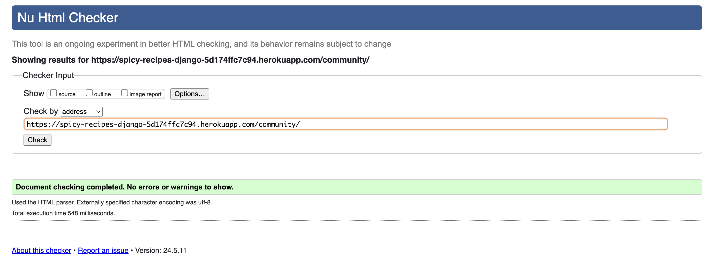
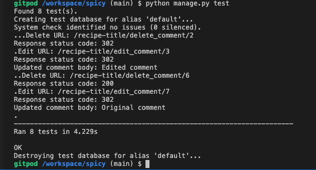

Back to  [`README.md`](README.md).

## Testing User Stories

At the end of the development process, a final check was made on the list of initially planned User Stories to document which ones have been completed.

The results are summarized in the following table:


As the table shows, all User Stories marked as part of the MVP (priority `must have`) have been completed, along with a significant number of User Stories that were outside the scope of the MVP.

The Epic [Manage own About info](https://github.com/blahosyl/spicy/issues/52) and its User Stories were marked as duplicates of the ones relating to User Profiles.

The Epics [Manage own ingredient quantities](https://github.com/blahosyl/spicy/issues/86) and [Manage own recipes](https://github.com/blahosyl/spicy/issues/57) have been implemented in the Admin panel by restricting the objects that Staff users have access to. 
As this functionality was not part of the MVP, and the allotted time did not allow for completion of all User Stories, implementing the same functionality in the UI was deemed outside the scope of the current version.  

Work items that were not part of the initial planning phase and were adding during the course of development as requirements became clarified are as follows:

- The Epic [Manage own ingredients (Collaborators)](https://github.com/blahosyl/spicy/issues/123) and its User Stories
- [the color theme selection functionality](https://github.com/blahosyl/spicy/issues/98)


## Code validation

### HTML validation

#### Home page validation

[Validation](https://validator.w3.org/nu/?doc=https%3A%2F%2Fspicy-recipes-django-5d174ffc7c94.herokuapp.com%2F) found no errors or warnings.


#### Home page paginated validation

[Validation](https://validator.w3.org/nu/?doc=https%3A%2F%2Fspicy-recipes-django-5d174ffc7c94.herokuapp.com%2F%3Fpage%3D2) found no errors or warnings.


#### Home page filtered validation

[Validation](https://validator.w3.org/nu/?doc=https%3A%2F%2Fspicy-recipes-django-5d174ffc7c94.herokuapp.com%2Ffilter%2F%3Ftaste%3Dsweet) found no errors or warnings.


#### Home page filtered paginated validation

[Validation](https://validator.w3.org/nu/?doc=https%3A%2F%2Fspicy-recipes-django-5d174ffc7c94.herokuapp.com%2Ffilter%2F%3Fpage%3D2%26diet%3Dvegetarian) found no errors or warnings.


#### Home page filtered with no results validation

[Validation](https://validator.w3.org/nu/?doc=https%3A%2F%2Fspicy-recipes-django-5d174ffc7c94.herokuapp.com%2Ffilter%2F%3Ftaste%3Dbitter) found no errors or warnings.


#### Search page validation

[Validation](https://validator.w3.org/nu/?doc=https%3A%2F%2Fspicy-recipes-django-5d174ffc7c94.herokuapp.com%2Fsearch%2F%3Fq%3Dcheese) found no errors or warnings.


#### Search page with no results

[Validation](https://validator.w3.org/nu/?doc=https%3A%2F%2Fspicy-recipes-django-5d174ffc7c94.herokuapp.com%2Fsearch%2F%3Fq%3Daperol) found no errors or warnings.


#### Search page with paginated link validation

[Validation](https://validator.w3.org/nu/?doc=https%3A%2F%2Fspicy-recipes-django-5d174ffc7c94.herokuapp.com%2Fsearch%2F%3Fpage%3D2%26q%3Dvegetarian) found no errors or warnings.


#### Signup: known issue

The Allauth template for [`Signup.html`](templates/account/Signup.html) has a [known issue](https://code-institute-room.slack.com/archives/C026PTF46F5/p1711715226907449) that produces [validation errors](https://validator.w3.org/nu/?doc=https%3A%2F%2Fspicy-recipes-django-5d174ffc7c94.herokuapp.com%2Faccounts%2Fsignup%2F). Since this is a problem with the framework code, and not the custom code written for this project, and it does not affect the functionality of the app, this was not corrected.


#### Signin validation

[Validation](https://validator.w3.org/nu/?doc=https%3A%2F%2Fspicy-recipes-django-5d174ffc7c94.herokuapp.com%2Faccounts%2Flogin%2F) found no errors or warnings.


#### Signout validation

[Validation](https://validator.w3.org/nu/?doc=https%3A%2F%2Fspicy-recipes-django-5d174ffc7c94.herokuapp.com%2Faccounts%2Flogout%2F) found no errors or warnings.


#### Confirm email validation

[Validation](https://validator.w3.org/nu/?doc=https%3A%2F%2Fspicy-recipes-django-5d174ffc7c94.herokuapp.com%2Faccounts%2Fconfirm-email%2F) found no errors or warnings.


#### Community validation

[Validation](https://validator.w3.org/nu/?doc=https%3A%2F%2Fspicy-recipes-django-5d174ffc7c94.herokuapp.com%2Fcommunity%2F) found no errors or warnings.



#### Profile detail validation

[Validation](https://validator.w3.org/nu/?doc=https%3A%2F%2Fspicy-recipes-django-5d174ffc7c94.herokuapp.com%2Fcommunity%2F8%2F) found no errors or warnings.


### CSS validation

`style.css` was validated with [Jigsaw](https://jigsaw.w3.org/css-validator/validator) and passed without errors or warnings.


### JavaScript validation

All self-written JavaScript files were validated with [JSHint](https://jshint.com/). No errors were found apart from the known issue below.

#### `comments.js`: known issue

The file `comments.js` (which is identical to [the one used in the walkthrough project](https://github.com/Code-Institute-Solutions/blog/blob/main/15_testing/static/js/comments.js)) produces the following error during JS validation:

```
1 undefined variable
bootstrap
```


#### `filter.js` validation

Validation found no issues.


#### `themes.js` validation

Validation found no issues.


### Pyton validation

All self-written or modified Python files in the project were validated with the [Code Institute PEP8 Linter](https://pep8ci.herokuapp.com/). No errors were found.

#### `collection` app Python validation

##### `admin.py`

Validation found no issues.


##### `forms.py`


##### `models.py`

Validation found no issues.


##### `test_forms.py`

Validation found no issues.


##### `test_views.py`

Validation found no issues.


##### `urls.py`

Validation found no issues.


##### `views.py`

Validation found no issues.


##### `urls.py`

Validation found no issues.


#### `community` app Python validation

##### `admin.py`

Validation found no issues.


##### `models.py`

Validation found no issues.


##### `views.py`

Validation found no issues.


##### `urls.py`

Validation found no issues.


### Project-level Python validation

##### `settings.py`

Validation found no issues.


##### `urls.py`

Validation found no issues.


## Manual feature testing

### Collection/recipes manual testing

####  Navigation bar | desktop 

|Action				|Expected result	|Result|
|---				|---				|:---:	|
|page loads    |hamburger icon not visible<br>logo and brand name visible<br>brand text visible<br>nav links visible<br>Search bar visible<br>color selector visible|✅|
|color selector changed|page color scheme changes persistently|✅|
|Community link clicked |[Community page](#community-page) loaded|✅|
|Recipes link clicked |[Home page](#home-page) loaded|✅|
|**Search** button clicked |[Search page](#Search-results-page) loaded|✅|
|logo and brand name clicked|[home page](#home-page) loaded|✅|


*Click to play video*

https://github.com/blahosyl/spicy/assets/26421503/7c897e0e-44b6-486a-afe9-7b4603f3bb12


####  Navigation bar | mobile 

|Action				|Expected result	|Result|
|---				|---				|:---:	|
|page loads    |hamburger icon visible<br>logo and brand name visible<br>brand text not visible<br>nav links not visible<br>Search bar not visible<br>color selector not visible|✅|
|hamburger icon clicked|Search bar and color selector revealed|✅|
|hamburger icon clicked again |Search bar and color selector hidden|✅|

*Click to play video*

https://github.com/blahosyl/spicy/assets/26421503/4f80ed67-5698-425b-85a8-9166ffde2373


####  User bar | if user signed in
|Action				|Expected result	|Result|
|---				|---				|:---:	|
|page loads    |"Welcome, `user`!" visible<br>"You are not logged in" not visible<br>Signout link visible|✅|
|Signout link clicked|[Signout page](#Signout-page) loaded|✅|

*Click to play video*

https://github.com/blahosyl/spicy/assets/26421503/c91a3a0b-db04-4886-aa12-7798926934bc


####  User bar | if user not signed in
|Action				|Expected result	|Result|
|---				|---				|:---:	|
|page loads    |"Welcome, `user`!" not visible<br>"You are not logged in" visible<br>Signin link visible<br>|✅|
|Signin link clicked|[Signin page](#Signin-page) loaded|✅|
|Signup link clicked|[Signup page](#Signup-page) loaded|✅|


*Click to play video*


https://github.com/blahosyl/spicy/assets/26421503/dec9b12d-9319-497f-8d89-f59fb99c8d19


####  Footer
|Action				|Expected result	|Result|
|---				|---				|:---:	|
|page loads    |copyright info visible<br>GitHub icon visible<br>LinkedIn icon visible|✅|
|GitHub icon clicked | GitHub profile opens in new tab|✅|
|LinkedIn icon clicked | LinkedIn profile opens in new tab|✅|

*Click to play video*

https://github.com/blahosyl/spicy/assets/26421503/6655b581-354b-43c9-a9c7-fbdae3ed3c08


####  Home page

Displays the list of recipes

|Action				|Expected result	|Result|
|---				|---				|:---:	|
|home page loads    |filters visible<br>recipe cards visible<br>pagination visible|✅|
|filter changed     |result count visible<br>recipe list is filtered|✅|
|result count > 6   |[pagination](#pagination-links) visible|✅|
|any recipe card clicked|corresponding [recipe detail page](#recipe-detail-page) loads|✅|

*Click to play video*


https://github.com/blahosyl/spicy/assets/26421503/ddf2f609-f4a6-4107-bd38-48024aba99f4


####  Recipe detail page

|Action				|Expected result	|Result|
|---				|---				|:---:	|
|recipe detail page loads|title visible<br>author visible<br>attributes visible (if any)<br>ingedients visible (if any)<br>image visible<br>total time, prep time & cook time visible<br>instructions visible<br>comments visible (if any)|✅|
|user not logged in|"Sign in to leave a comment"|✅|
|user logged in|comment field visible<br>comment field & button visible<br>own pending comments visible|✅|
|user logged in<br>user has comments|Edit & Delete button visible for each comment<br>|✅|
|comment button clicked<br>comment field empy|"Please fill in this field"|✅|
|comment button clicked<br>comment field not empy|comment appears as unapproved<br>edit & delete buttons appear|✅|
|Edit button clicked|comment text filled into comment field<br>Submit button changes to Update|✅|
|Update button clicked|comment text updated<br>comment set to unapproved|✅|
|Delete button clicked|delete modal pops up|✅|
|Close button clicked on delete modal |delete modal closes<br>comment remains|✅|
|Delete button clicked on delete modal|comment is deleted<br>confirmation message appears|✅|

*Click to play video*


https://github.com/blahosyl/spicy/assets/26421503/014a8da2-57dc-4c47-8f1b-3ac8cfc0c1c9

*Click to play video*


https://github.com/blahosyl/spicy/assets/26421503/5ba96824-3df9-4c56-8126-208083207e7d


####  Search results page

|Action				|Expected result	|Result|
|---				|---				|:---:	|
|Search page loaded |result count visible<br>recipe list is filtered|✅|
|result count > 6   |[pagination](#pagination-links) visible|✅|

*Click to play video*


https://github.com/blahosyl/spicy/assets/26421503/2e4cc54d-e155-4dfe-bd7d-b4f7fe1e1387


####  Pagination links
|Action				|Expected result	|Result|
|---				|---				|:---:	|
|more recipes/results exist |**Next** button visible|✅|
|previous results exist |**Prev** button visible|✅|
|**Next** button clicked |next page of results is loaded|✅|
|**Prev** button clicked |previous page of results is loaded|✅|

*Click to play video*


https://github.com/blahosyl/spicy/assets/26421503/716b9563-cbd5-400e-8963-d0fcb08f6492


### Community manual testing

####  Community page

Displays the list of profiles


|Action				|Expected result	|Result|
|---				|---				|:---:	|
|Community page loads  |profile cards visible|✅|
|any profile card clicked|corresponding [profile detail page](#profile-detail-page) loads|✅|

####  Profile detail page

|Action				|Expected result	|Result|
|---				|---				|:---:	|
|Profile detail page loads|name or username visible<br>status visible<br>pronouns visible (if any)<br>neurodiversity visible (if any)<br>about text visible (if any)|✅|

*Click to play video*


https://github.com/blahosyl/spicy/assets/26421503/ed51b208-71cb-4eec-b1bf-7a8c7a433ede


### Authentication manual testing

####  Signin page
|Action				|Expected result	|Result|
|---				|---				|:---:	|
|Signin page loads    |Signin text visible<br>Signup link visible<br>username field visible<br>password field visible<br>Signup button visible<br>password reset link visible|✅|
|Signup link clicked|[Signup page](#Signup-page) loaded|✅|
|password reset link clicked|[password reset page](#password-reset-page) loaded|✅|
|Signin button clicked<br>any field empty |"Please fill in this field"|✅|
|Signin button clicked<br>noth fields filled<br>credentials not correct|"The username and/or password you specified are not correct."|✅|
|Signin button clicked<br>both fields filled<br>credentials correct<br>email not confirmed |user is signed in<br>[Email sent page](#email-sent-page) loads<br>confirmation email sent|✅|
|Signin button clicked<br>both fields filled<br>credentials correct<br>email confirmed|user is signed in<br>[home page](#home-page) loads|✅|

*Click to play video*


https://github.com/blahosyl/spicy/assets/26421503/9d5eb187-e503-42b5-82a8-15479b801add


####  Signout page
|Action				|Expected result	|Result|
|---				|---				|:---:	|
|Signout page loads  |Signout text visible<br>Signout button visible|✅|
|Signout button clicked  |user signed out<br>home page loads|✅|

*Click to play video*


https://github.com/blahosyl/spicy/assets/26421503/f62c36c3-d8b2-48d5-89d0-59ecf49c0c99


####  Signup page
|Action				|Expected result	|Result|
|---				|---				|:---:	|
|Signup page loads    |Signup text visible<br>Signin link visible<br>email filed visible<br>username field visible<br>password field visible<br>password rules visible<br>password (again) field visible<br>Signup button visible<br>password reset link visible|✅|
|Signin link clicked|[Signin page](#Signin-page) loaded|✅|
|password reset link clicked|[password reset page](#password-reset-page) loaded|✅|
|Signup button clicked<br>any field empty |"Please fill in this field"|✅|
|Signup button clicked<br>email field has no `@`|"Please include an `@`..."|✅|
|Signup button clicked<br>password fields don't match<br>OR password does not conform to rules |password fields get emptied|✅|
|Signup button clicked<br>email already registered|"A user with that username already exists"|✅|
|Signup button clicked<br>all fields filled correctly |user is signed up<br>[Email sent page](#email-sent-page) loads<br>verification email sent to user|✅|
|user clicks link in verification email|[Confirm email page](#confirm-email-page) loads|

*Click to play video*


https://github.com/blahosyl/spicy/assets/26421503/0d272dd9-1541-4aa5-b72a-f20f115cc479


####  Email sent page
|Action				|Expected result	|Result|
|---				|---				|:---:	|
|Email sent page loads    |confirmation email sent to user|✅|


Signup confirmation email


####  Confirm email page
|Action				|Expected result	|Result|
|---				|---				|:---:	|
|Confirm email page loads|confirm text visible<br>confirm button visible<br> |✅|
|confirm button clicked    |resitration confirmed<br>[Signin page](#Signin-page) loads|✅|

*Click to play video*


https://github.com/blahosyl/spicy/assets/26421503/8a521faa-9be8-4505-84a6-d22b07c68115


####  Password reset page
|Action				|Expected result	|Result|
|---				|---				|:---:	|
|password reset page loads |reset text visible<br>email field visible<br>reset button visible|✅|
|reset button clicked<br>email not valid|"email not valid"|
|reset button clicked<br>email valid<br>email not in database|reset confirmation page loads<br>"we have no record of you" email sent|✅|
|reset button clicked<br>email valid<br>email in database|reset confirmation page loads<br>password reset email sent|✅|
|reset link in email clicked|[change password page](#change-password-page) shown|✅|

*Click to play video*


https://github.com/blahosyl/spicy/assets/26421503/1be204aa-a718-4d30-970c-9686135a8ca8

Password reset email sent to unregistered user


Password reset email sent to registered user


####  Change password page
|Action				|Expected result	|Result|
|---				|---				|:---:	|
|change password loads|change password text visible<br>new password field visible<br>new password again field visible<br>change pasword button visible<br> |✅|
|change pasword button clicked<br>only 1 password field filled|"Please fill out this field"|✅|
|change pasword button clicked<br>passwords don't match|"You must type the same password each time"|✅|
|change pasword button clicked<br>passwords match|"Your password is now changed"|✅|

*Click to play video*


https://github.com/blahosyl/spicy/assets/26421503/1ba29844-7477-45f4-9666-2b5bc55c4589


## Accessibility testing

###  Lighthouse

The following pages have been tested with Lighthouse emulating both a mobile and a desktop use case:

- home / recipe list
- home / recipe list with paginated link
- home / recipe list filtered
- home / recipe list filtered with no results
- home / recipe list filtered with paginated link
- search
- search with no results
- search with paginated link
- register / `/signup`
- `signin`
- signout  `/logout`confirm
- `confirm-email` (when an unvalidated user tries to log in)
- community / profile list
- profile detail

The accessibility audits uncovered some minor issues with color contrasts and heading precedence. These were all corrected (see the commits of [the corresponding Issue](https://github.com/blahosyl/spicy/issues/131)), so that the final accessibility audit result for all pages tested is 100%.


All accessibility reports can be found in [this folder](testing/lighthouse/accessibility/). Reports starting with `100` are the final ones, while those with lower numbers are earlier reports whose issues have been corrected.

### Color contrasts

In addition to Lighthouse, color contrasts were also tested with the [WebAIM Contrast Checker](https://webaim.org/resources/contrastchecker). This was especially important given that the project has multiple color schemes.

#### Color specifications

###### Orange theme specifications

|color name 	|HEX code|
|---			|---	|
|very-dark-orange|#531D04| 
|dark-orange|#D7410F|
|med-orange|#FD7E14|
|light-orange|#f7ddcf|

###### Blue theme specifications

|color name 	|HEX code
|---			|---	|
|very-dark-blue|#08374F|
|dark-blue|#0F6895|
|med-blue|#20A6E9|
|light-blue|#BFE6F7|

###### Green theme specifications

|color name 	|HEX code|
|---			|---	|
|very-dark-green|#084f37|
|dark-green|#1b871d|
|med-green|#7ef075|
|light-green|#ceedcc|

###### Nuetral color specifications

|color name 	|HEX code|
|---			|---	|
|light-neutral|#F9FAFC|
|white|#FFFFFF|

#### Orange theme contrast check

| color 1 |color 2 |contrast | [WCAG AA/AAA](https://ialabs.ie/what-is-the-difference-between-wcag-a-aa-and-aaa/) |Comment|
|---			|---		|:---:		|:---:| ---|
|very-dark-orange 	|white 	        |13.58:1 	|AAA|
|very-dark-orange 	|light-orange 	|10.48:1 	|AAA| |
|very-dark-orange 	|med-orange 	|5.28:1 	|AA|Only used for large text|
|very-dark-orange 	|light-neutral 	|13:01:1 	|AAA| |
|dark-orange	    |white 	        |4.51:1 	|AA | |
|dark-orange	    |light-orange 	|3.48:1 	|AA|Only used for large text|


#### Blue theme contrast check

| color 1 |color 2 |contrast | [WCAG AA/AAA](https://ialabs.ie/what-is-the-difference-between-wcag-a-aa-and-aaa/) |Comment|
|---			|---		|:---:		|:---:| ---|
|very-dark-blue 	|white 	        |12.57:1 	|AAA|
|very-dark-blue 	|light-blue 	|10.48:1 	|AAA| |
|very-dark-blue 	|med-blue 	|4.6:1 	|AAA|Only used for large text|
|very-dark-blue 	|light-neutral 	|12.04:1 	|AAA| |
|dark-blue	    |white 	        |6.11:1 	|AA | |
|dark-blue	    |light-blue 	|4.62:1 	|AAA|Only used for large text|

#### Green theme contrast check

| color 1 |color 2 |contrast | [WCAG AA/AAA](https://ialabs.ie/what-is-the-difference-between-wcag-a-aa-and-aaa/) |Comment|
|---			|---		|:---:		|:---:| ---|
|very-dark-green 	|white 	        |9.61:1 	|AAA|
|very-dark-green 	|light-green 	|7.6:1 	|AAA| |
|very-dark-green 	|med-green 	|6.68:1 	|AAA|Only used for large text|
|very-dark-green 	|light-neutral 	|9.2:1 	|AAA| |
|dark-green	    |white 	        |4.63:1 	|AA | |
|dark-green	    |light-green 	|3.66   :1 	|AAA|Only used for large text|

## Automated testing

Automated tests were written for the following test cases:

`collection/test_forms`:

- comment form is valid
- comment form is invalid

`collection/test_views`:

- render recipe detail page with comment form
- successful comment submission
- successful comment editing
- unsuccessful comment editing
- successful comment deletion
- unsuccessful comment deletion

All automated tests pass without issues.



## Bugs

All bugs are tracked in [GitHub Issues](https://github.com/blahosyl/spicy/issues?q=is%3Aissue+label%3Abug).

#### Known bugs

Known bugs are listed in [GitHub Issues](https://github.com/blahosyl/spicy/issues?q=is%3Aissue+label%3Abug+is%3Aopen).

#### Solved bugs

Solved bugs are listed in [GitHub Issues](https://github.com/blahosyl/spicy/issues?q=is%3Aissue+label%3Abug+is%3Aclosed).
